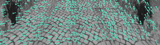
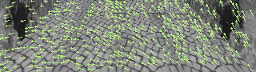
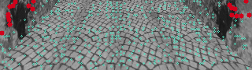
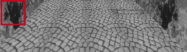

# Obstacle detection based on the optical flow

This algorithm is based on the paper: N. Ohnishi and A. Imiya, “Appearance-based navigation and homing
for autonomous mobile robot,” Image and Vision Computing, vol. 31, no. 6, pp. 511–532, 2013.

[Link to paper](https://www.sciencedirect.com/science/article/abs/pii/S0262885612002120 "Previous paper")

# Installation

OS: Ubuntu 18.04

Requirements:
1. Python 2.7
2. OpenCV (tested on version 3.3, older version should work as well)

# Options

The obstacle detector contains three option for key points selection: 1) Harris corner detector, 2) Harris corner detector per region, 3) Vertices of mesh.

There are two option to compute the planar flow: 1) Homography, 2) Affine transformation.

# Usage

You can test the obstacle detector adding your image sequence in a folder called "images" inside the Obstacle-Detector-Optical-Flow root directory.

Then run
```
cd [Obstacle-Detector-Optical-Flow root dir]
python optical_flow_detector.py
```
To test diferent key points selection, edit the variable `key_points_selector` in the script.

# Result

Optical Flow:


Planar Flow:


Obstacle key points (RED):


Bounding boxes:


Contact:myrna.castillo.silva@gmail.com
